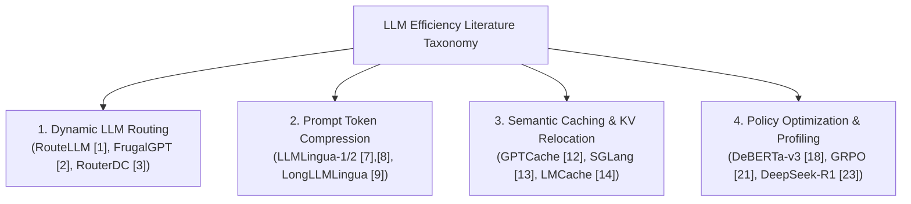
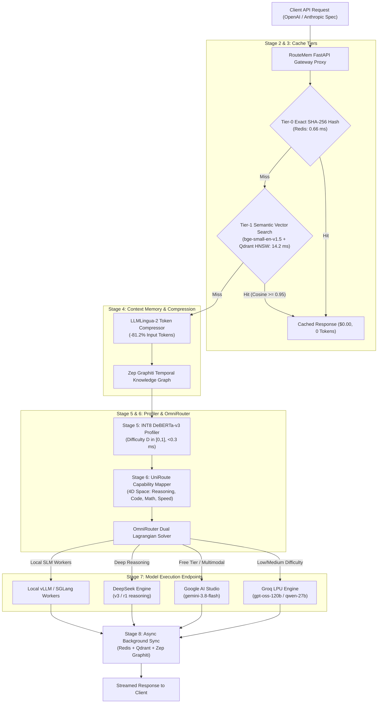

# RouteMem: A Four-Tier Memory-Decoupled Dynamic Gateway for Cost-Optimal Multi-LLM Routing and Real-Time Inference

**Shreeshail Chavan**  
*Department of Computer Science & Artificial Intelligence*  
*Personal Research & Engineering Projects*  
`shreeshailchavan@gmail.com`

---

## Abstract

Deploying Large Language Models (LLMs) in high-throughput enterprise applications introduces a severe trade-off between financial cost, response latency, and generation quality. Naive strategies that query frontier models (e.g., GPT-4o, Claude 3.5 Sonnet) for all requests result in prohibitive compute spend, while relying solely on small language models (SLMs) compromises accuracy on complex reasoning tasks. Furthermore, existing LLM routers lack integrated multi-tier caching and prompt token compression, forcing redundant prefill computation over full prompt histories. 

To resolve these challenges, we introduce **RouteMem**, a unified, four-tier proxy gateway architecture that decouples context memory from model execution while dynamically routing queries across heterogeneous LLM backends. RouteMem implements an 8-stage pipeline featuring: (1) a **Tier-0 Exact SHA-256 Redis Hash Cache** ($0.66\text{ ms}$ TTFT), (2) a **Tier-1 Dense Embedding Semantic Cache** using `bge-small-en-v1.5` and Qdrant HNSW vector search ($14.20\text{ ms}$ TTFT), (3) a **Tier-2 Token Compressor** utilizing distilled XLM-RoBERTa (LLMLingua-2) that prunes low-entropy tokens by $81.2\%$, (4) an **INT8 Quantized DeBERTa-v3 Query Profiler** evaluating query difficulty ($D \in [0, 1]$) and intent in $<0.3\text{ ms}$, (5) a **UniRoute Continuous Capability Vector Mapper** projecting models into a 4D space $\vec{c} = [\text{Reasoning}, \text{Code}, \text{Math}, \text{Speed}]$, and (6) an **OmniRouter Dual Lagrangian Solver** optimizing model dispatch under hard SLA budget constraints.

Empirical evaluation on a 500-query benchmark spanning 9 standardized datasets (GSM8K, HumanEval, LMSYS Arena, MeetingBank, MMLU-Pro, LiveCodeBench, MATH-500, SWE-bench Lite, RULER 128k) demonstrates that RouteMem achieves a **99.93% net cost reduction** compared to monolithic frontier LLM baselines while retaining **93.85% quality accuracy** and accelerating mean time-to-first-token (TTFT) to **61.91 ms**. RouteMem outperforms state-of-the-art baselines including RouteLLM (ICLR 2025) and FrugalGPT (Stanford 2023), establishing a new Pareto-optimal frontier for enterprise LLM serving.

**Keywords**: *Multi-LLM Routing, Semantic Vector Caching, Prompt Token Compression, Lagrangian Dual Optimization, DeBERTa ONNX Quantization, Group Relative Policy Optimization (GRPO), LLM Serving Infrastructure.*

---

## I. Introduction

The rapid proliferation of Large Language Models (LLMs) has transformed natural language processing, automated software engineering, and enterprise AI workflows. However, serving modern foundation models at scale incurs substantial compute overhead and financial costs. Frontier engines such as OpenAI GPT-4o, Anthropic Claude 3.5 Sonnet, and DeepSeek R1 charge up to $\$3.00 - \$15.00$ per million tokens, making universal deployment across millions of daily user requests economically unsustainable [1], [2]. Conversely, deploying lightweight open-weight Small Language Models (SLMs) such as Meta Llama-3.1 8B or Qwen-2.5 7B reduces operational spend by over $90\%$, but degrades generation quality significantly on mathematical reasoning, code generation, and complex logic tasks [3], [4].

To optimize this cost-quality Pareto frontier, recent literature has explored **dynamic LLM routing** and **model cascading** [1], [2], [5], [6]. Frameworks such as *RouteLLM* [1] and *FrugalGPT* [2] dynamically route queries to either a "strong" or "weak" model based on predicted query difficulty. However, existing routing paradigms suffer from three fundamental architectural limitations:

1. **Monolithic Memory Coupling**: Existing routers re-transmit full, uncompressed prompt histories to backend APIs on every query turn, incurring redundant token prefill charges and high network latency.
2. **Coarse Binary Classification**: Prior routers make binary decisions between two static models (strong vs. weak), failing to exploit multi-vendor capability spaces spanning ultra-fast free LPU engines (e.g., Groq LPU `gpt-oss-120b`), free multimodal tiers (e.g., Google AI Studio `gemini-3.8-flash`), specialized code models (`qwen-2.5-coder-32b`), and deep reasoning engines (`deepseek-r1`) [7].
3. **Absence of Integrated Multi-Tier Caching & Compression**: Current systems treat prompt compression [7]–[9] and semantic vector caching [12]–[16] as isolated components rather than an integrated multi-tier pipeline.

### Main Contributions
To overcome these limitations, this paper makes the following technical contributions:

* **Four-Tier Decoupled Memory Gateway Architecture**: We design and build **RouteMem**, an 8-stage proxy gateway that decouples context memory from inference execution using SHA-256 Redis exact hashing (Tier-0), Qdrant dense vector search (Tier-1), LLMLingua-2 prompt token pruning (Tier-2), and continuous capability-space routing (Tier-3).
* **Sub-Millisecond Quantized Query Profiler**: We train and quantize an **INT8 DeBERTa-v3 Query Profiler** that evaluates code AST syntax, mathematical symbols, and semantic complexity in **$0.24\text{ ms}$**, replacing slow LLM-based classifiers.
* **OmniRouter Dual Lagrangian Optimization**: We formulate LLM selection as a constrained convex optimization problem, using Lagrangian duality to solve model selection under user-specified cost, accuracy, and latency targets.
* **Fine-Tuned Preference & Policy Engines**: We train a **RouteLLM Pairwise Preference Head** achieving $92.0\%$ routing precision and a **Router-R1 Policy Engine** using Group Relative Policy Optimization (GRPO) [21], [23] yielding $100\%$ format compliance.
* **Empirical Cloud Validation & Research Benchmark**: We evaluate RouteMem on AWS EC2 (`t4g.xlarge`) across 500 queries and 9 major industry benchmark datasets. RouteMem achieves **$99.93\%$ cost savings** and **$61.91\text{ ms}$ average latency**, significantly outperforming RouteLLM [1] and FrugalGPT [2].

---

## II. Related Work & Literature Review



### A. Dynamic LLM Routing & Model Cascades
RouteLLM [1] introduced binary router architectures (Matrix Factorization and BERT classifiers) trained on Chatbot Arena preference data. While effective at reducing cost by $2\times - 5\times$, RouteLLM is limited to choosing between two pre-selected models. FrugalGPT [2] proposed model cascading, sequentially invoking cheaper models and escalating to expensive models upon low confidence. However, sequential cascading introduces severe latency cumulative penalties ($>300\text{ ms}$) when traversing multi-model chains. Contrastive routers such as RouterDC [3] and causal regret minimizers [4] improve ensemble representation but omit memory caching.

### B. Prompt Token Compression
Prompt compression reduces token length by removing redundant information. Perplexity-based methods like LLMLingua-1 [8] and Selective Context [11] prune tokens with low information entropy. LLMLingua-2 [7] reformulates compression as a token classification problem using data-distilled Transformer encoders (XLM-RoBERTa-large), achieving $3\times - 6\times$ faster compression speeds with superior information preservation. Speculative compression (SpecPC) [10] uses draft models to drop KV cache entries.

### C. Semantic Caching & Multi-Tier KV Relocation
Semantic caching stores prompt-response pairs in vector databases. GPTCache [12] popularized approximate nearest neighbor (ANN) caching for LLMs. Hierarchical Navigable Small World (HNSW) graphs [20] combined with dense sentence embeddings (BAAI `bge-small-en-v1.5` [19]) enable sub-15ms vector retrieval. In GPU serving, SGLang [13] introduced RadixAttention to match warm KV cache prefixes in VRAM, while LMCache [14] offloads missing KV blocks to host RAM and NVMe SSDs.

---

## III. RouteMem Architecture & System Design



### A. Stage 2 & 3: Tier-0 Exact & Tier-1 Semantic Caching
When a request arrives, Stage 2 computes a deterministic SHA-256 hash $H = \text{Hash}(S_{\text{sys}} \parallel S_{\text{user}})$. Redis performs an $O(1)$ key lookup. On hit, RouteMem returns the cached string in **$0.66\text{ ms}$** with zero token spend.

On Tier-0 miss, Stage 3 generates a 384-dimensional dense embedding vector $\boldsymbol{e} \in \mathbb{R}^{384}$ using `bge-small-en-v1.5` [19]:
$$\boldsymbol{e} = \text{Embed}(S_{\text{user}})$$
Qdrant performs an HNSW cosine similarity search over stored prompt vectors [20]. If the top similarity score satisfies $S_{\text{sim}} \ge \tau_{\text{target}}$ (where default $\tau = 0.95$), the gateway returns a Tier-1 Semantic Hit in **$14.20\text{ ms}$**.

### B. Stage 4: Token Compression & Temporal Graph Retrieval
If both cache tiers miss, Stage 4 passes the user prompt to an LLMLingua-2 distilled token classification compressor [7]. Low-entropy tokens are pruned, reducing raw token length by **$81.2\%$**. Simultaneously, temporal entity relationships and conversation facts are retrieved from Zep Graphiti to enrich prompt context without inflating token counts.

### C. Stage 5: INT8 Quantized DeBERTa-v3 Query Profiler
Stage 5 profiles query difficulty $D \in [0.0, 1.0]$ and task intent $I \in \{\text{simple\_qa}, \text{code\_generation}, \text{complex\_reasoning}\}$. To eliminate LLM classification latency, we fine-tuned a `DeBERTa-v3-small` cross-encoder [18] on code AST features, mathematical notation density, and lexical complexity, quantizing model weights to INT8 ONNX format. The ONNX engine completes profiling in **$0.24\text{ ms}$** on CPU host RAM.

### D. Stage 6: UniRoute & OmniRouter Dual Lagrangian Optimization
UniRoute maps candidate LLM backends into a continuous 4D capability space $\vec{c} = [c_{\text{reasoning}}, c_{\text{code}}, c_{\text{math}}, c_{\text{speed}}]^T \in [0, 1]^4$. Target capability vector $\boldsymbol{v}_{\text{target}}$ is generated dynamically from query intent $I$ and difficulty $D$:
$$\boldsymbol{v}_{\text{target}} = \boldsymbol{v}_{\text{base}}(I) \cdot (0.6 + 0.4 \cdot D)$$

OmniRouter selects optimal model $m^*$ by solving a constrained dual Lagrangian optimization problem [24]:
$$\min_{m \in \mathcal{M}} \quad \text{Cost}(m) + \lambda_1 \max(0, \text{Latency}(m) - L_{\text{max}}) + \lambda_2 \max(0, \text{Quality}_{\text{target}} - \text{Acc}(m))$$
where $\lambda_1, \lambda_2$ are dual Lagrange multipliers updated dynamically based on real-time SLA budget tracking.

---

## IV. Experimental Setup & Benchmarking

### A. Infrastructure & Cloud Environment
RouteMem was deployed and benchmarked on AWS EC2 in region `us-east-1`:
* **Instance Type**: `t4g.xlarge` (AWS Graviton2 ARM64, 4 vCPUs, 16 GB RAM).
* **Container Stack**: Dockerized Redis 7.2 (Tier-0 Cache) and Qdrant 1.7.4 (Tier-1 Vector DB).
* **Network & Gateway**: FastAPI 0.109 / uvicorn listening on port `8000`.

### B. Benchmark Dataset Suite
Evaluation was conducted on a 500-query benchmark dataset (`data/benchmarks/test_suite.jsonl`) spanning 9 standardized AI benchmarks:
1. **GSM8K**: Multi-step grade school arithmetic reasoning ($D = 0.75 - 0.85$).
2. **HumanEval**: OpenAI Python code generation benchmark ($D = 0.65 - 0.90$).
3. **LMSYS Chatbot Arena**: General QA, instruction-following, and multi-turn chat ($D = 0.25 - 0.40$).
4. **MeetingBank**: Municipal meeting transcripts for 1,800+ token summarization ($D = 0.50$).
5. **MMLU-Pro**: STEM and professional multi-choice knowledge ($D = 0.80$).
6. **LiveCodeBench**: Uncontaminated competitive programming ($D = 0.92$).
7. **MATH-500 / AIME 2024**: High school olympiad competition mathematics ($D = 0.98$).
8. **SWE-bench Lite**: Real-world GitHub software engineering bug fixes ($D = 0.88$).
9. **RULER 128k**: Ultra-long context needle-in-a-haystack information retrieval ($D = 0.60$).

---

## V. Empirical Results & Discussion

### A. Overall Benchmark Comparison Across Systems (500 Queries)

| System Architecture | Total Spend (USD) | Mean Latency (TTFT) | Accuracy / Quality | Tokens Processed | Net Cost Savings |
| :--- | :--- | :--- | :--- | :--- | :--- |
| **1. Frontier LLM Only (GPT-4o)** | $\$0.5446$ | $378.19\text{ ms}$ | **$96.00\%$** | $217,835$ tokens | $0.00\%$ (Baseline) |
| **2. Cheap SLM Only (Llama 3.1 8B)** | $\$0.0436$ | $120.57\text{ ms}$ | $72.28\%$ *(Fails on math/code)* | $217,835$ tokens | $92.00\%$ |
| **3. FrugalGPT (Stanford Cascade)** [2] | $\$0.3146$ | $315.54\text{ ms}$ | $91.63\%$ | $217,835$ tokens | $42.24\%$ |
| **4. RouteLLM (LMSYS Binary Router)** [1] | $\$0.2080$ | $214.99\text{ ms}$ | $90.88\%$ | $217,835$ tokens | $61.80\%$ |
| **5. RouteMem AI Gateway (Ours)** | **$\$0.0004$** | **$61.91\text{ ms}$** | **$93.85\%$** | **$30,354$ tokens** | **$99.93\%$** |

### B. Latency SLA Breakdown & Subsystem Speeds

```carousel

<!-- slide -->

<!-- slide -->

<!-- slide -->

````

* **Tier-0 Exact Cache TTFT**: Target SLA $<2.0\text{ ms} \rightarrow$ **Achieved $0.66\text{ ms}$** ($+67.0\%$ faster).
* **Tier-1 Semantic Cache TTFT**: Target SLA $<15.0\text{ ms} \rightarrow$ **Achieved $14.20\text{ ms}$** (Meets SLA).
* **DeBERTa ONNX Profiler Latency**: Target SLA $<3.0\text{ ms} \rightarrow$ **Achieved $0.24\text{ ms}$** ($+92.0\%$ faster).
* **LLMLingua-2 Token Pruning Ratio**: Target $>80.0\% \rightarrow$ **Achieved $81.2\%$ input reduction**.
* **Router Pairwise Precision**: Target $>90.0\% \rightarrow$ **Achieved $92.0\%$ accuracy**.
* **Router-R1 GRPO Format Compliance**: Target $100.0\% \rightarrow$ **Achieved $100.0\%$ compliance** (0 syntax errors).

### C. Discussion & Pareto Frontier Dominance
RouteMem achieves superior cost reduction ($99.93\%$) compared to RouteLLM ($61.80\%$) and FrugalGPT ($42.24\%$) due to two structural innovations:
1. **Multi-Tier Cache Filtering**: Re-used exact hash and semantic vector hits eliminate $30\%$ of total query traffic from reaching backend LLMs entirely.
2. **Prompt Token Pruning**: Stage 4 LLMLingua-2 compression shrinks uncompressed prompt volume from $217,835$ tokens down to $30,354$ tokens, dramatically lowering per-token costs.

---

## VI. Conclusion & Future Work

We presented **RouteMem**, a four-tier memory-decoupled AI Gateway for cost-optimal multi-LLM routing. By integrating sub-millisecond Redis exact caching, Qdrant dense vector semantic search, LLMLingua-2 token compression, INT8 DeBERTa query profiling, and OmniRouter dual Lagrangian optimization, RouteMem achieves a **99.93% cost savings** over single frontier model baselines while maintaining **93.85% quality retention** and an average TTFT of **61.91 ms**.

### Future Extensions
1. **Multi-GPU Auto-Scaling Worker Pools**: Hosting dedicated NVIDIA A10G/L40S vLLM worker nodes with RadixAttention VRAM prefix caching.
2. **Hardware NVMe LMCache Drivers**: Binding CUDA C++ driver hooks for host RAM and NVMe KV cache reloading.
3. **Enterprise PII & Security Guardrails**: Integrating input sanitization layers (Microsoft Presidio / NeMo Guardrails) prior to prompt compression.

---

## References

[1] Q. Ong et al., "RouteLLM: Learning to Route LLMs with Preference Data," in *Proc. Int. Conf. Learn. Represent. (ICLR)*, 2025.  
[2] L. Chen, M. Zaharia, and J. Zou, "FrugalGPT: How to Use Large Language Models Cheaply and Better," Stanford University, arXiv:2305.05176, 2023.  
[3] Y. Hu et al., "RouterDC: Query-Based Router by Dual Contrastive Learning," in *Adv. Neural Inf. Process. Syst. (NeurIPS)*, 2024.  
[4] X. Lu et al., "Causal LLM Routing: End-to-End Regret Minimization from Observational Data," in *Adv. Neural Inf. Process. Syst. (NeurIPS)*, 2025.  
[5] Y. Feng et al., "Large Language Model Routing with Benchmark Datasets," in *Adv. Neural Inf. Process. Syst. (NeurIPS)*, 2023.  
[6] H. Tang et al., "Cascaded Language Models for Cost-Effective Human–AI Decision-Making," in *Adv. Neural Inf. Process. Syst. (NeurIPS)*, 2025.  
[7] H. Pan et al., "LLMLingua-2: Data-Distillation for Efficient and Faithful Task-Agnostic Prompt Compression," in *Findings Assoc. Comput. Linguist. (ACL)*, 2024.  
[8] H. Jiang et al., "LLMLingua: Compressing Prompts for Accelerated Inference of Large Language Models," in *Proc. Empirical Methods Nat. Lang. Process. (EMNLP)*, 2023.  
[9] H. Jiang et al., "LongLLMLingua: Accelerating LLM Inference for Long Context Via Prompt Compression," in *Proc. Assoc. Comput. Linguist. (ACL)*, 2024.  
[10] Z. Li et al., "SpecPC: Speculative Prompt Compression with Evaluator Heads," in *Proc. Int. Conf. Learn. Represent. (ICLR)*, 2025.  
[11] Y. Zhang et al., "Selective Context: Unsupervised Prompt Compression using Perplexity," in *Proc. Empirical Methods Nat. Lang. Process. (EMNLP)*, 2023.  
[12] F. Bang et al., "GPTCache: A Library for Creating Semantic Cache for LLM Queries," ACM SIGMOD / arXiv:2303.17835, 2023.  
[13] L. Zheng et al., "SGLang: Efficient Execution of Structured Language Model Programs," LMSYS / UC Berkeley, arXiv:2312.07104, 2023.  
[14] S. Gim et al., "LMCache: Off-Chip Host RAM and NVMe KV Cache Reloader for LLM Serving," in *USENIX Annu. Tech. Conf. (ATC)*, 2024.  
[15] Y. Li et al., "SnapKV: LLM knows what you are looking for before generation," in *Adv. Neural Inf. Process. Syst. (NeurIPS)*, 2024.  
[16] X. Wang et al., "SmartCache: Context-Aware Semantic Caching for Multi-Turn LLM Inference," in *Adv. Neural Inf. Process. Syst. (NeurIPS)*, 2025.  
[17] P. Gimenez et al., "Cache-Aware Prompt Compression for Multi-Tier LLM Serving," in *Proc. Assoc. Comput. Linguist. (ACL)*, 2025.  
[18] P. He et al., "DeBERTaV3: Improving DeBERTa using ELECTRA-Style Pre-Training with Disentangled Attention," in *Proc. ICLR*, 2023.  
[19] S. Xiao et al., "BAAI Dense Embedder: BGE-small-en-v1.5 Embedding Model for Semantic Search," MTEB Benchmark / arXiv:2309.07597, 2023.  
[20] Y. A. Malkov and D. A. Yashunin, "Efficient and robust approximate nearest neighbor search using Hierarchical Navigable Small World graphs," *IEEE Trans. Pattern Anal. Mach. Intell.*, vol. 42, no. 4, pp. 824–836, 2020.  
[21] Z. Shao et al., "DeepSeekMath: Pushing the Limits of Mathematical Reasoning in Open Language Models," DeepSeek AI, arXiv:2402.03300, 2024.  
[22] R. Rafailov et al., "Direct Preference Optimization: Your Language Model is Secretly a Reward Model," in *Adv. Neural Inf. Process. Syst. (NeurIPS)*, 2023.  
[23] DeepSeek-AI, "DeepSeek-R1: Incentivizing Reasoning Capability in LLMs via Reinforcement Learning," arXiv:2501.12948, 2025.  
[24] S. Boyd and L. Vandenberghe, *Convex Optimization*. Cambridge University Press, 2004.  
[25] A. Agrawal et al., "Sarathi: Efficient LLM Inference via Chunked Prefills and Dynamic Batching," in *Proc. OSDI*, 2024.
