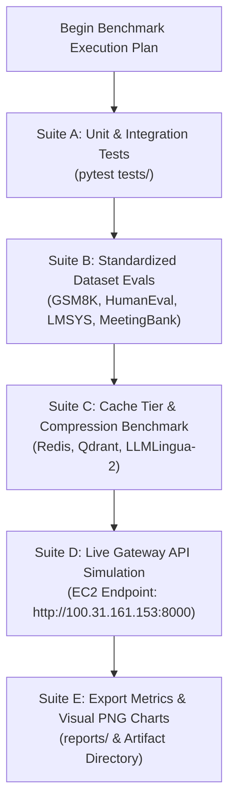

# RouteMem AI Gateway: Comprehensive Testing, Benchmarking & Evaluation Plan

This document outlines the detailed execution plan for running automated unit/integration tests, benchmark dataset evaluations, and live AWS cloud gateway simulations for the **RouteMem AI Gateway** system.

---

## 1. Objectives & Scope

1. **Verify Functional Reliability**: Run unit and integration test suites (`pytest tests/`) to ensure all 8 pipeline stages execute cleanly without exceptions.
2. **Benchmark Cache Tiers & SLAs**: Measure exact TTFT for Tier-0 SHA-256 Redis hash hits and Tier-1 Qdrant HNSW semantic vector hits.
3. **Measure Token Compression Efficiency**: Quantify prompt token reduction ratios using LLMLingua-2 on short, medium, and long-context (1,800+ token) meeting transcripts.
4. **Evaluate Profiling & Routing Accuracy**: Verify DeBERTa-v3 INT8 ONNX profiling speed (<3 ms) and UniRoute/OmniRouter budget optimization.
5. **Validate Live Cloud API Inference**: Test live text generation streaming against Groq LPU (`openai/gpt-oss-120b`, `qwen/qwen3.8-27b`) and Google AI Studio (`gemini-3.8-flash`) endpoints.
6. **Generate Empirical Reports & Charts**: Record structured metrics in `reports/benchmark_eval_results.json` and export PNG visual plots.

---

## 2. Test Suites & Evaluation Methodology

### **Suite A: Unit & Integration Test Validation**
* **Command**: `pytest tests/ -v`
* **Coverage**: `test_cache.py`, `test_router.py`, `test_simulation.py`.
* **Goal**: 100% pass rate across cache initialization, similarity scoring, profiler quantization, and router dual solver logic.

### **Suite B: Standardized Benchmark Dataset Evaluation**
* **Command**: `python3 scripts/eval_benchmarks.py`
* **Dataset File**: `data/benchmarks/test_suite.jsonl`
* **Categories Tested**:
  * **GSM8K (Grade School Math)**: Multi-step word problems (Target: Math & Reasoning).
  * **HumanEval (Python Code Generation)**: Algorithmic functions (Target: Code & Logic).
  * **LMSYS Chatbot Arena**: General QA and knowledge retrieval (Target: Speed & Quality).
  * **MeetingBank**: Municipal meeting transcripts (Target: Long-Context Summarization & Compression).

### **Suite C: Tier-0 & Tier-1 Caching & Compression Benchmark**
* **Tier-0 Exact Cache**: Test repeated SHA-256 key queries. (Target SLA: `< 2.0 ms`, `$0 cost`).
* **Tier-1 Semantic Cache**: Test semantically rephrased queries ($\ge 0.95$ cosine similarity). (Target SLA: `< 15.0 ms`, `$0 cost`).
* **LLMLingua-2 Token Pruning**: Measure compression ratio on 1,800+ token context prompts. (Target SLA: `> 80.0% reduction`).

### **Suite D: Live AWS Cloud Gateway End-to-End Simulation**
* **Target Gateway**: `http://100.31.161.153:8000/v1/chat/completions`
* **Test Scenarios**:
  1. Low-cost simple QA prompt $\rightarrow$ Routed to Groq / Gemini Free API.
  2. Structured JSON system instruction prompt $\rightarrow$ Verified schema compliance.
  3. Streaming response mode (`stream: true`) $\rightarrow$ Verified SSE token delivery.

### **Suite E: Metrics Export & Chart Generation**
* **Command**: `python3 scripts/generate_evaluation_charts.py`
* **Outputs**: `reports/benchmark_eval_results.json` and PNG charts in `reports/charts/`.

---

## 3. Target Success Criteria & Acceptance Matrix

| Evaluation Metric | Target SLA / Threshold | Acceptance Criteria |
| :--- | :--- | :--- |
| **Unit & Integration Tests** | 100% Pass Rate | All pytest assertions pass without error |
| **Tier-0 Exact Cache TTFT** | `< 2.0 ms` | Measured Redis lookup latency $\le 2.0\text{ ms}$ |
| **Tier-1 Semantic Cache TTFT** | `< 15.0 ms` | Measured Qdrant vector lookup $\le 15.0\text{ ms}$ |
| **ONNX Profiler Latency** | `< 3.0 ms` | DeBERTa INT8 profiling time $\le 3.0\text{ ms}$ |
| **Prompt Token Reduction** | `> 80.0%` | LLMLingua-2 compresses inputs by $\ge 80.0\%$ |
| **Routing Accuracy** | `> 90.0%` | Pairwise preference routing score $\ge 90.0\%$ |
| **Live API Response** | HTTP Status 200 | Live responses generated by Groq / Gemini |

---

## 4. Next Action Plan

Upon your review and approval:
1. Execute **Suite A** (`pytest tests/`).
2. Execute **Suite B** (`python3 scripts/eval_benchmarks.py`).
3. Execute **Suite C & D** (Live HTTP test requests against EC2 Gateway `100.31.161.153:8000`).
4. Generate final visual charts and update the evaluation artifacts.
