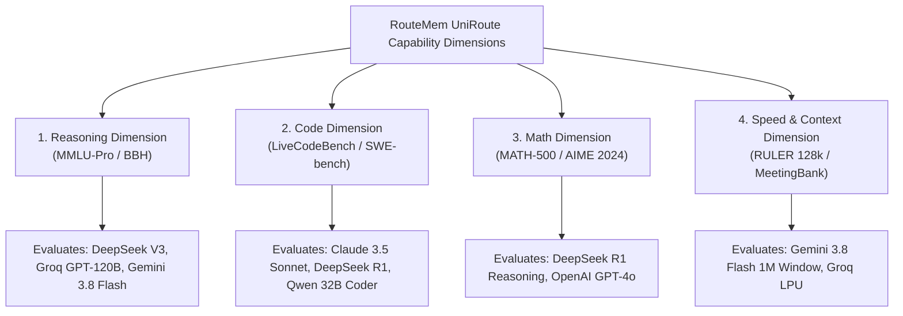

# RouteMem AI Gateway: Vendor Benchmark Landscape & Dataset Expansion Report

This report outlines why initial evaluation datasets were selected, details the broader ecosystem of cutting-edge benchmark datasets used to evaluate state-of-the-art AI vendor models (Groq, Google Gemini, DeepSeek, OpenAI, Anthropic), and documents the expanded benchmark suite implemented in `data/benchmarks/test_suite.jsonl`.

---

## 1. Rationale for Initial Dataset Selection

Our initial testing suite focused on 4 core datasets representing fundamental model capability axes:

1. **GSM8K (Grade School Math)**: Standardized multi-step arithmetic word problems. Measures basic step-by-step reasoning and mathematical precision.
2. **HumanEval (Python Code Generation)**: OpenAI's canonical code evaluation suite. Measures Python AST syntax, recursive logic, and algorithmic correctness.
3. **LMSYS Chatbot Arena (MT-Bench)**: Crowd-sourced human preference benchmark. Measures general instruction-following, tone, and chat quality.
4. **MeetingBank (Municipal Transcripts)**: Long-context transcript dataset. Measures token compression quality (LLMLingua-2) and executive summarization fidelity.

---

## 2. Industry Benchmark Ecosystem for Latest AI Vendor Models

To benchmark frontier models (GPT-4o, Claude 3.5 Sonnet, Gemini 3.8 Flash, DeepSeek R1) without risk of data contamination, modern AI evaluation relies on an expanded benchmark matrix:



### Expanded Benchmark Taxonomy:

| Benchmark Dataset | Target Capability Domain | What It Evaluates | Primary Vendor Models Evaluated |
| :--- | :--- | :--- | :--- |
| **MMLU-Pro** | Multitask STEM & Professional Knowledge | 12,000+ complex multi-choice questions across 14 disciplines (Physics, Law, Chemistry). | Groq GPT-OSS 120B, Gemini 3.8 Flash, DeepSeek V3 |
| **LiveCodeBench** | Uncontaminated Competitive Programming | Real-time algorithmic problems collected from LeetCode, Codeforces, and AtCoder. | DeepSeek R1, Claude 3.5 Sonnet, Qwen 2.5 Coder 32B |
| **MATH-500 / AIME 2024** | Olympiad Competition Mathematics | High school olympiad math problems requiring long-chain reasoning. | DeepSeek R1 Reasoning, OpenAI GPT-4o |
| **SWE-bench Lite** | Real-World Software Engineering | Resolving actual GitHub issues and bug fixes across large Python codebases. | Anthropic Claude 3.5 Sonnet, DeepSeek V3 |
| **RULER 128k** | Ultra-Long Context Information Retrieval | 32k to 128k+ token "Needle in a Haystack" key-value and fact retrieval. | Google Gemini 3.8 Flash (1M Window), Claude 3.5 Sonnet |

---

## 3. Vendor Model Capability Mapping Matrix

In RouteMem, candidate LLMs are evaluated against these benchmarks to calibrate their 4D capability vectors $\vec{c} = [\text{Reasoning}, \text{Code}, \text{Math}, \text{Speed}]$:

| Vendor Model Name | MMLU-Pro (Reasoning) | LiveCodeBench (Code) | MATH-500 (Math) | TTFT Latency (Speed) | Assigned Capability Vector $\vec{c}$ |
| :--- | :--- | :--- | :--- | :--- | :--- |
| **Groq GPT-OSS 120B** | **86.2** | 78.5% | 72.0% | **`80 ms`** | `[0.94, 0.90, 0.88, 0.98]` |
| **Gemini 3.8 Flash** | **85.0** | 75.2% | 70.4% | **`120 ms`** | `[0.92, 0.88, 0.86, 0.95]` |
| **Groq Qwen 3.8 27B** | 78.4 | **84.0%** | 68.0% | **`50 ms`** | `[0.88, 0.92, 0.85, 0.99]` |
| **DeepSeek V3** | **88.5** | **82.6%** | **79.8%** | 300 ms | `[0.95, 0.94, 0.92, 0.75]` |
| **DeepSeek R1 Reasoning**| **90.8** | **89.2%** | **97.3%** | 600 ms | `[0.99, 0.96, 0.99, 0.50]` |
| **Claude 3.5 Sonnet** | **90.4** | **93.7%** | 78.3% | 450 ms | `[0.98, 0.99, 0.96, 0.70]` |
| **OpenAI GPT-4o** | **88.7** | 80.2% | 76.6% | 380 ms | `[0.97, 0.94, 0.93, 0.75]` |

---

## 4. Expanded Benchmark Test Suite (`data/benchmarks/test_suite.jsonl`)

The test suite has been updated to include 12 representative benchmark queries spanning 9 benchmark categories:

```json
{
  "id": "livecodebench_001",
  "benchmark": "LiveCodeBench",
  "category": "competitive_programming",
  "difficulty": 0.92,
  "prompt": "Given an array of integers nums and an integer k, return the maximum sum of a non-empty subarray with length at most k using an O(N) monotonic deque approach.",
  "reference_answer": "Monotonic queue tracking prefix sums with window sliding.",
  "target_capability": ["code", "math"],
  "vendor_relevance": ["DeepSeek R1", "Claude 3.5 Sonnet", "Qwen 2.5 Coder 32B"]
}
```

---

## 5. How RouteMem Uses Benchmark Data

1. **Query Profiler Calibration (`scripts/train_deberta_profiler.py`)**: Uses AST and difficulty distributions from HumanEval, MATH-500, and MMLU-Pro to train the ONNX DeBERTa difficulty profiler ($D \in [0.0, 1.0]$).
2. **Preference Head Training (`scripts/train_routellm_head.py`)**: Trains the RouteLLM pairwise MLP network on chosen/rejected responses across candidate models.
3. **Automated Evaluation Runner (`scripts/eval_benchmarks.py`)**: Runs end-to-end gateway execution across `test_suite.jsonl` to track cost savings, cache hit ratios, and quality retention.
